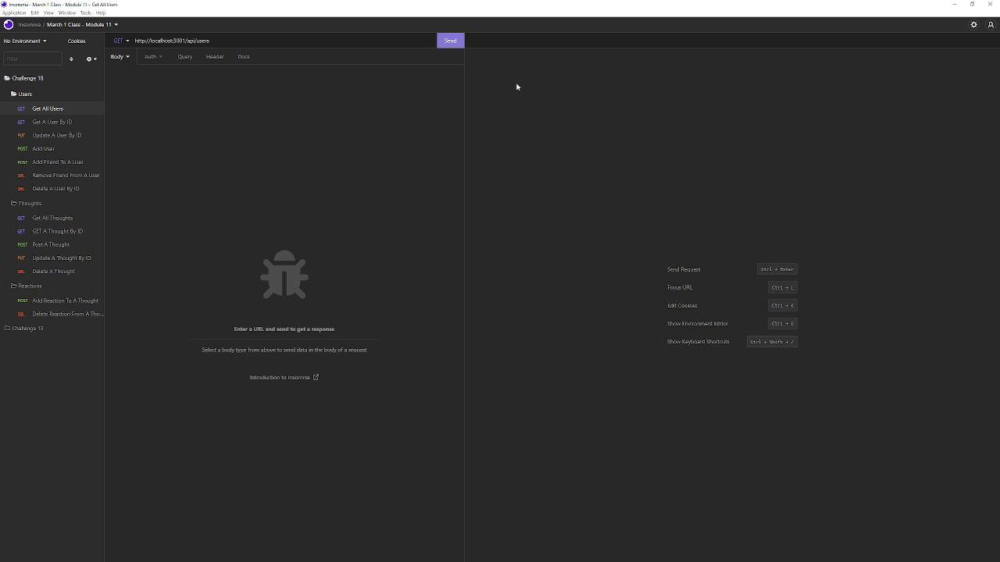

# Social Network API

[](https://opensource.org/licenses/MIT)

## Description
This application is an API for a social networking site, created to take advantage of a NoSQL backend database -- in this case, MongoDB serves as our database server. It is written in JavaScript and runs on Node with an Express API to interact with the MongoDB database. Packages used include Express for web framework, and Mongoose for Object Document Modeling (ODM) work with the MongoDB backend.



## Table of Contents
- [Link to Walkthrough Video](#link-to-walkthrough-video)
- [User Story](#user-story)
- [Installation](#installation)
- [Usage](#usage)
- [Tests](#tests)
- [Author](#author)
- [License](#license)
- [Contributing](#contributing)
- [Questions](#questions)

## Link to Walkthrough Video
As this application is not deployed publicly, here is a walkthrough video that demonstrates the functionality of the API:

[https://drive.google.com/file/d/1lj_G-2yVHIqxzqaEWJO3kpWJD60IJKzD/view](https://drive.google.com/file/d/1lj_G-2yVHIqxzqaEWJO3kpWJD60IJKzD/view)

## User Story
This NoSQL-based social network API was created to meet the requirements of the following user story:
```
AS A social media startup
I WANT an API for my social network that uses a NoSQL database
SO THAT my website can handle large amounts of unstructured data
```

## Installation
1. Clone the repository, or download and extract an archive of it
2. Run "npm install" to obtain the required dependencies

## Usage
1. Invoke the app with "npm start" or "node server.js"
2. Send requests to the routes at http://localhost:3001/api to begin using the API

## Tests
There is no test suite created for this application.

## Author
Application written by Daniel Birmingham ([GitHub profile](https://github.com/Prolix19/)).

## License
[The MIT License](https://opensource.org/licenses/MIT)

## Contributing
This project is not open to contributions at this time.

## Questions
You may reach me via email at 51418825+Prolix19@users.noreply.github.com with any additional questions you may have.
